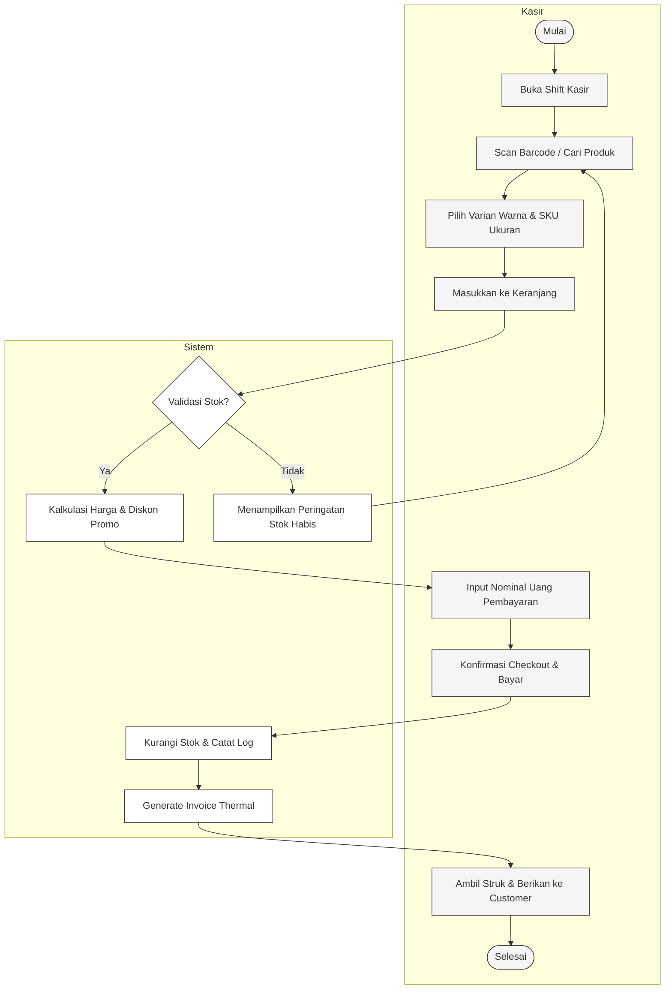
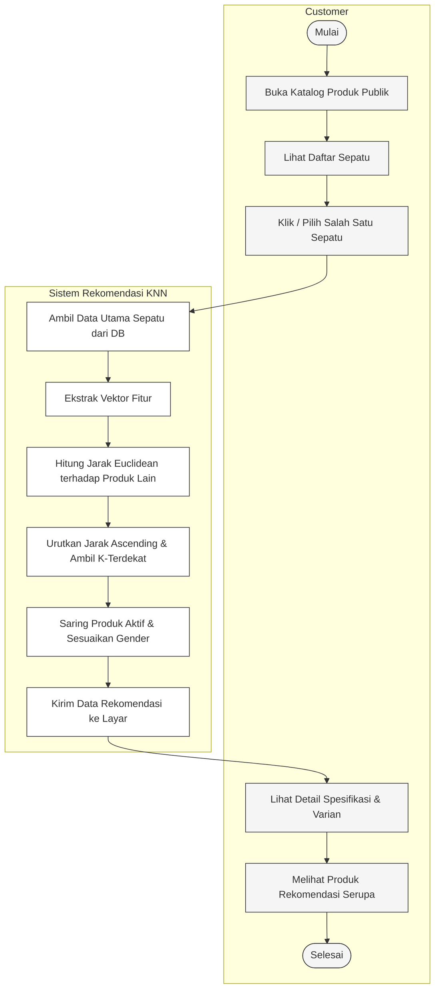
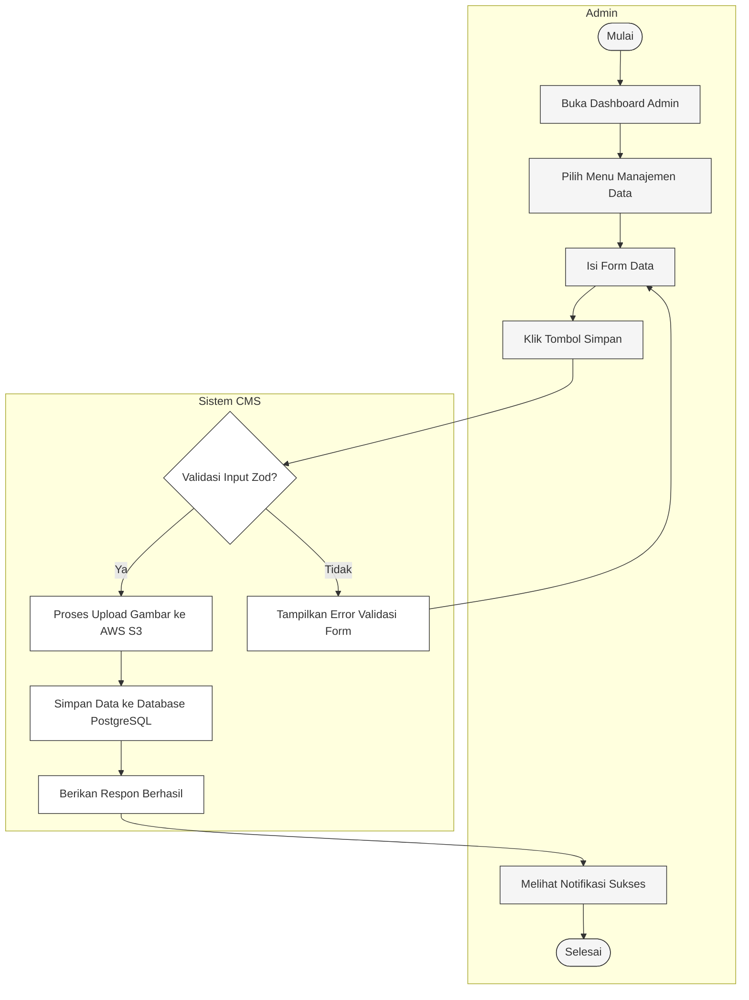

# Activity Diagrams - Fordza-Web

Dokumen ini berisi Activity Diagram (Diagram Aktivitas) menggunakan format **Mermaid** dengan visualisasi swimlane yang bersih, formal, dan rapi tanpa emotikon/emoji, disesuaikan dengan kebutuhan penulisan ilmiah/skripsi.

---

## 1. Activity Diagram: Transaksi Kasir (POS)

---

## 2. Activity Diagram: Pencarian Produk & Rekomendasi KNN (Customer)

---

## 3. Activity Diagram: Manajemen Data (Admin)

