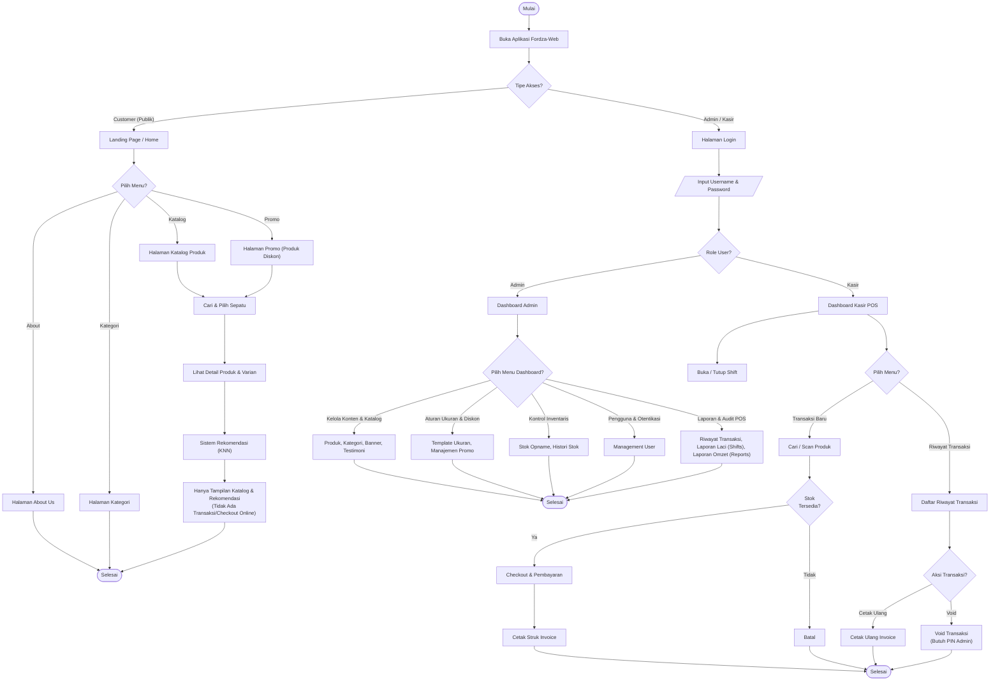

# Flowchart Sistem Fordza-Web

Berikut adalah rancangan algoritma flowchart sistem Fordza-Web yang lengkap dengan detail halaman Landing Page, Kategori, About Us untuk Customer, serta detail menu Transaksi, Riwayat, Reprint, dan Void pada Kasir:

