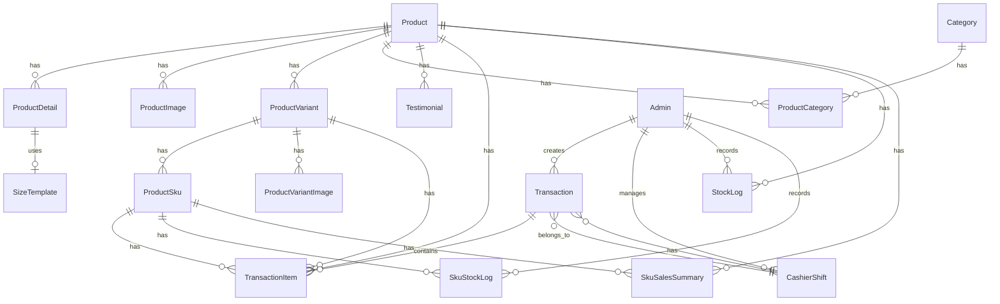

# Database Schema - Fordza-Web

## 📋 Overview

Fordza-Web menggunakan **PostgreSQL** sebagai database dengan **Prisma ORM 7.2.0** untuk data access layer.

**Total Models:** 19 models  
**Database Type:** Relational (PostgreSQL)  
**ORM Version:** Prisma 7.2.0 with Neon adapter (@prisma/adapter-pg)

### **Prisma Configuration**

**Generator:**
```prisma
generator client {
  provider = "prisma-client"
  output   = "../app/generated/prisma"
}

datasource db {
  provider = "postgresql"
}
```

**Custom Output Path:** Generated client berada di `app/generated/prisma` untuk better organization.

**Neon Serverless Support:** Menggunakan `@prisma/adapter-pg` untuk connection pooling yang optimal dengan Neon database.

---

## 🗂️ Entity Relationship Diagram (ERD)



---

## 📊 Models Detail

### **1. Product**

Tabel utama untuk produk. Menyimpan data cached untuk performa (price, stock, rating).

**Fields:**

| Field | Type | Nullable | Default | Description |
|-------|------|----------|---------|-------------|
| id | String (CUID) | No | auto | Primary key |
| productCode | String | No | - | Kode produk unik |
| name | String | No | - | Nama produk |
| shortDescription | String | No | - | Deskripsi singkat |
| price | Decimal(12,2) | Yes | null | Harga terendah (cached) |
| stock | Int | No | 0 | Total stok (cached) |
| productType | String | No | - | Tipe produk |
| gender | String | No | "Unisex" | Man/Woman/Unisex |
| isPopular | Boolean | No | false | Flag popular |
| isBestseller | Boolean | No | false | Flag bestseller |
| isNew | Boolean | No | true | Flag new |
| isActive | Boolean | No | true | Status aktif |
| avgRating | Float | No | 0 | Rating rata-rata (cached) |
| totalReviews | Int | No | 0 | Jumlah review (cached) |
| **createdById** | **String** | **Yes** | **null** | **Admin yang buat** |
| **updatedById** | **String** | **Yes** | **null** | **Admin yang update** |
| createdAt | DateTime | No | now() | Waktu dibuat |
| updatedAt | DateTime | No | auto | Waktu diupdate |
| deletedAt | DateTime | Yes | null | Soft delete timestamp |

**Indexes:**
- `productCode` (unique)
- `isActive`
- `gender`
- `deletedAt`
- **`createdAt`** ← New
- **`createdById`** ← New (foreign key)
- **`updatedById`** ← New (foreign key)

**Relations:**
- `detail` → ProductDetail (1:1)
- `images` → ProductImage[] (1:N)
- `variants` → ProductVariant[] (1:N)
- `categories` → ProductCategory[] (M:N via pivot)
- `testimonials` → Testimonial[] (1:N)
- `transactionItems` → TransactionItem[] (1:N)
- `stockLogs` → StockLog[] (1:N)
- `salesSummaries` → SkuSalesSummary[] (1:N)
- **`createdBy` → Admin (N:1, onDelete: SetNull)** ← New
- **`updatedBy` → Admin (N:1, onDelete: SetNull)** ← New

---

### **2. ProductDetail**

Detail lengkap produk (data berat yang jarang diakses).

**Fields:**

| Field | Type | Nullable | Description |
|-------|------|----------|-------------|
| id | String (CUID) | No | Primary key |
| productId | String | No | Foreign key → Product |
| description | Text | No | Deskripsi lengkap (HTML) |
| notes | Text | Yes | Catatan tambahan |
| material | String | Yes | Material produk |
| outsole | String | Yes | Jenis outsole |
| insole | String | Yes | Jenis insole |
| closureType | String | Yes | Tipe penutup |
| origin | String | Yes | Negara asal |
| sizeTemplateId | String | Yes | Foreign key → SizeTemplate |

**Indexes:**
- `productId` (unique)
- `sizeTemplateId`

**Relations:**
- `product` → Product (N:1)
- `sizeTemplate` → SizeTemplate (N:1)

---

### **3. ProductVariant**

Varian produk per warna/material.

**Fields:**

| Field | Type | Nullable | Description |
|-------|------|----------|-------------|
| id | String (CUID) | No | Primary key |
| variantCode | String | No | Kode varian unik |
| color | String | No | Nama warna |
| basePrice | Decimal(12,2) | No | Harga jual |
| comparisonPrice | Decimal(12,2) | Yes | Harga coret (gimmick) |
| discountPercent | Float | Yes | Persentase diskon |
| isActive | Boolean | No | Status aktif |
| productId | String | No | Foreign key → Product |
| createdAt | DateTime | No | Waktu dibuat |
| updatedAt | DateTime | No | Waktu diupdate |
| deletedAt | DateTime | Yes | Soft delete timestamp |

**Indexes:**
- `variantCode` (unique)
- `productId`
- `isActive`

**Relations:**
- `product` → Product (N:1)
- `skus` → ProductSku[] (1:N)
- `images` → ProductVariantImage[] (1:N)
- `transactionItems` → TransactionItem[] (1:N)

---

### **4. ProductSku**

SKU per ukuran (unit terkecil yang dijual).

**Fields:**

| Field | Type | Nullable | Description |
|-------|------|----------|-------------|
| id | String (CUID) | No | Primary key |
| size | String | No | Ukuran |
| stock | Int | No | Stok tersedia |
| priceOverride | Decimal(12,2) | Yes | Harga override (bigsize) |
| isActive | Boolean | No | Status aktif |
| variantId | String | No | Foreign key → ProductVariant |
| createdAt | DateTime | No | Waktu dibuat |
| updatedAt | DateTime | No | Waktu diupdate |
| deletedAt | DateTime | Yes | Soft delete timestamp |

**Indexes:**
- `variantId`
- `isActive`
- `(variantId, size)` (unique composite)

**Relations:**
- `variant` → ProductVariant (N:1)
- `transactionItems` → TransactionItem[] (1:N)
- `stockLogs` → SkuStockLog[] (1:N)
- `salesSummaries` → SkuSalesSummary[] (1:N)

---

### **5. ProductImage**

Gambar produk utama.

**Fields:**

| Field | Type | Nullable | Description |
|-------|------|----------|-------------|
| id | String (CUID) | No | Primary key |
| url | String | No | URL gambar (S3) |
| key | String | No | S3 object key |
| productId | String | No | Foreign key → Product |

**Indexes:**
- `productId`

**Relations:**
- `product` → Product (N:1)

---

### **6. ProductVariantImage**

Gambar per varian.

**Fields:**

| Field | Type | Nullable | Description |
|-------|------|----------|-------------|
| id | String (CUID) | No | Primary key |
| url | String | No | URL gambar (S3) |
| key | String | No | S3 object key |
| variantId | String | No | Foreign key → ProductVariant |

**Indexes:**
- `variantId`

**Relations:**
- `variant` → ProductVariant (N:1)

---

### **7. Category**

Kategori produk.

**Fields:**

| Field | Type | Nullable | Description |
|-------|------|----------|-------------|
| id | String (CUID) | No | Primary key |
| name | String | No | Nama kategori |
| shortDescription | String | Yes | Deskripsi singkat |
| imageUrl | String | No | URL gambar (S3) |
| imageKey | String | Yes | S3 object key |
| isActive | Boolean | No | Status aktif |
| order | Int | No | Urutan tampilan |
| **createdById** | **String** | **Yes** | **Admin yang buat** |
| **updatedById** | **String** | **Yes** | **Admin yang update** |
| **createdAt** | **DateTime** | **No** | **Waktu dibuat** |
| **updatedAt** | **DateTime** | **No** | **Waktu diupdate** |
| deletedAt | DateTime | Yes | Soft delete timestamp |

**Indexes:**
- `isActive`
- `order`
- **`createdById`** ← New (foreign key)
- **`updatedById`** ← New (foreign key)

**Relations:**
- `products` → ProductCategory[] (M:N via pivot)
- **`createdBy` → Admin (N:1, onDelete: SetNull)** ← New
- **`updatedBy` → Admin (N:1, onDelete: SetNull)** ← New

---

### **8. ProductCategory**

Pivot table untuk relasi Product-Category (many-to-many).

**Fields:**

| Field | Type | Nullable | Description |
|-------|------|----------|-------------|
| productId | String | No | Foreign key → Product |
| categoryId | String | No | Foreign key → Category |
| assignedAt | DateTime | No | Waktu assign |

**Primary Key:** `(productId, categoryId)` (composite)

**Indexes:**
- `productId`
- `categoryId`

**Relations:**
- `product` → Product (N:1)
- `category` → Category (N:1)

---

### **9. SizeTemplate**

Template ukuran (EU, US, UK, dll).

**Fields:**

| Field | Type | Nullable | Description |
|-------|------|----------|-------------|
| id | String (CUID) | No | Primary key |
| name | String | No | Nama template |
| type | String | No | Tipe (shoes, sandals, dll) |
| sizes | String[] | No | Array ukuran |
| createdAt | DateTime | No | Waktu dibuat |
| updatedAt | DateTime | No | Waktu diupdate |

**Relations:**
- `productDetails` → ProductDetail[] (1:N)

---

### **10. Testimonial**

Review/testimoni produk.

**Fields:**

| Field | Type | Nullable | Description |
|-------|------|----------|-------------|
| id | String (CUID) | No | Primary key |
| productId | String | No | Foreign key → Product |
| customerName | String | No | Nama customer |
| rating | Int | No | Rating 1-5 |
| content | Text | No | Isi testimoni |
| isActive | Boolean | No | Status aktif |
| createdAt | DateTime | No | Waktu dibuat |

**Indexes:**
- `productId`
- `isActive`

**Relations:**
- `product` → Product (N:1)

---

### **11. Banner**

Banner homepage.

**Fields:**

| Field | Type | Nullable | Description |
|-------|------|----------|-------------|
| id | String (CUID) | No | Primary key |
| title | String | Yes | Judul banner |
| imageUrl | String | No | URL gambar (S3) |
| imageKey | String | No | S3 object key |
| linkUrl | String | Yes | URL tujuan |
| isActive | Boolean | No | Status aktif |
| **createdById** | **String** | **Yes** | **Admin yang buat** |
| **updatedById** | **String** | **Yes** | **Admin yang update** |
| createdAt | DateTime | No | Waktu dibuat |
| **updatedAt** | **DateTime** | **No** | **Waktu diupdate** |
| **deletedAt** | **DateTime** | **Yes** | **Soft delete timestamp** |

**Indexes:**
- `isActive`
- **`createdById`** ← New (foreign key)
- **`updatedById`** ← New (foreign key)

**Relations:**
- **`createdBy` → Admin (N:1, onDelete: SetNull)** ← New
- **`updatedBy` → Admin (N:1, onDelete: SetNull)** ← New

---

### **12. Admin**

User admin & kasir.

**Fields:**

| Field | Type | Nullable | Description |
|-------|------|----------|-------------|
| id | String (CUID) | No | Primary key |
| username | String | No | Username (unique) |
| password | String | No | Password (hashed) |
| name | String | Yes | Nama lengkap |
| role | Enum | No | ADMIN/KASIR |
| pin | String | Yes | PIN 4 digit |
| createdAt | DateTime | No | Waktu dibuat |
| updatedAt | DateTime | No | Waktu diupdate |
| deletedAt | DateTime | Yes | Soft delete timestamp |

**Indexes:**
- `username` (unique)
- `role`

**Relations:**
- `transactions` → Transaction[] (1:N)
- `shifts` → CashierShift[] (1:N)
- `stockLogs` → StockLog[] (1:N)
- `skuStockLogs` → SkuStockLog[] (1:N)
- **`productsCreated` → Product[] (1:N)** ← New
- **`productsUpdated` → Product[] (1:N)** ← New
- **`categoriesCreated` → Category[] (1:N)** ← New
- **`categoriesUpdated` → Category[] (1:N)** ← New
- **`promosCreated` → Promo[] (1:N)** ← New
- **`promosUpdated` → Promo[] (1:N)** ← New
- **`bannersCreated` → Banner[] (1:N)** ← New
- **`bannersUpdated` → Banner[] (1:N)** ← New

**Enums:**
- `Role`: ADMIN, KASIR

---

### **13. Transaction**

Transaksi penjualan.

**Fields:**

| Field | Type | Nullable | Description |
|-------|------|----------|-------------|
| id | String (CUID) | No | Primary key |
| invoiceNo | String | No | Nomor invoice (unique) |
| totalPrice | Decimal(12,2) | No | Total harga |
| amountPaid | Decimal(12,2) | No | Uang diterima |
| change | Decimal(12,2) | No | Kembalian |
| status | Enum | No | PAID/VOID |
| notes | Text | Yes | Catatan |
| cancelReason | Text | Yes | Alasan void |
| shiftId | String | Yes | Foreign key → CashierShift |
| kasirId | String | No | Foreign key → Admin |
| customerName | String | Yes | Nama customer |
| customerPhone | String | Yes | No. telepon customer |
| createdAt | DateTime | No | Waktu transaksi |

**Indexes:**
- `invoiceNo` (unique)
- `status`
- `kasirId`
- `shiftId`
- **`createdAt`** ← New
- **`(kasirId, createdAt)` composite** ← New
- **`(status, createdAt)` composite** ← New

**Relations:**
- `kasir` → Admin (N:1)
- `shift` → CashierShift (N:1)
- `items` → TransactionItem[] (1:N)

**Enums:**
- `TransactionStatus`: PAID, VOID

---

### **14. TransactionItem**

Item dalam transaksi (snapshot data saat dijual).

**Fields:**

| Field | Type | Nullable | Description |
|-------|------|----------|-------------|
| id | String (CUID) | No | Primary key |
| quantity | Int | No | Qty |
| basePriceAtSale | Decimal(12,2) | No | Harga saat dijual |
| productName | String | No | Nama produk (snapshot) |
| productCode | String | Yes | Kode produk (snapshot) |
| discountAmount | Decimal(12,2) | No | Diskon nominal |
| variantId | String | Yes | Foreign key → ProductVariant |
| variantColor | String | Yes | Warna (snapshot) |
| skuId | String | Yes | Foreign key → ProductSku |
| skuSize | String | Yes | Ukuran (snapshot) |
| gimmickPriceAtSale | Decimal(12,2) | Yes | Harga coret (snapshot) |
| promoName | String | Yes | Nama promo (snapshot) |
| transactionId | String | No | Foreign key → Transaction |
| productId | String | No | Foreign key → Product |

**Indexes:**
- `transactionId`
- `productId`
- `variantId`
- `skuId`

**Relations:**
- `transaction` → Transaction (N:1)
- `product` → Product (N:1)
- `variant` → ProductVariant (N:1)
- `sku` → ProductSku (N:1)

---

### **15. StockLog**

History stok level produk (cached total).

**Fields:**

| Field | Type | Nullable | Description |
|-------|------|----------|-------------|
| id | String (CUID) | No | Primary key |
| productId | String | No | Foreign key → Product |
| delta | Int | No | Perubahan stok (+/-) |
| currentStock | Int | No | Stok setelah perubahan |
| type | String | No | SALE/VOID/RESTOCK/ADJUSTMENT |
| notes | Text | Yes | Catatan |
| operatorId | String | Yes | Foreign key → Admin |
| createdAt | DateTime | No | Waktu perubahan |

**Indexes:**
- `productId`
- `type`
- `operatorId`
- `createdAt`
- **`(productId, createdAt)` composite** ← New
- **`(type, createdAt)` composite** ← New

**Relations:**
- `product` → Product (N:1)
- `operator` → Admin (N:1)

---

### **16. SkuStockLog**

History stok level SKU (per ukuran).

**Fields:**

| Field | Type | Nullable | Description |
|-------|------|----------|-------------|
| id | String (CUID) | No | Primary key |
| skuId | String | No | Foreign key → ProductSku |
| delta | Int | No | Perubahan stok (+/-) |
| currentStock | Int | No | Stok setelah perubahan |
| size | String | No | Ukuran (snapshot) |
| color | String | No | Warna (snapshot) |
| type | String | No | SALE/VOID/RESTOCK/ADJUSTMENT |
| notes | Text | Yes | Catatan |
| operatorId | String | Yes | Foreign key → Admin |
| createdAt | DateTime | No | Waktu perubahan |

**Indexes:**
- `skuId`
- `type`
- `operatorId`
- `createdAt`
- **`(skuId, createdAt)` composite** ← New
- **`(type, createdAt)` composite** ← New

**Relations:**
- `sku` → ProductSku (N:1)
- `operator` → Admin (N:1)

---

### **17. SkuSalesSummary**

OLAP table untuk dashboard (agregasi penjualan harian).

**Fields:**

| Field | Type | Nullable | Description |
|-------|------|----------|-------------|
| id | String (CUID) | No | Primary key |
| date | DateTime | No | Tanggal (00:00:00 WIB) |
| skuId | String | Yes | Foreign key → ProductSku |
| productId | String | No | Foreign key → Product |
| productName | String | No | Nama produk (snapshot) |
| productCode | String | No | Kode produk (snapshot) |
| variantColor | String | No | Warna (snapshot) |
| skuSize | String | No | Ukuran (snapshot) |
| totalQty | Int | No | Total qty terjual |
| totalRevenue | Decimal(12,2) | No | Total revenue |
| totalOrders | Int | No | Jumlah transaksi |
| createdAt | DateTime | No | Waktu dibuat |
| updatedAt | DateTime | No | Waktu diupdate |

**Indexes:**
- `date`
- `(date, productId, variantColor, skuSize)` (unique composite)

**Relations:**
- `product` → Product (N:1)
- `sku` → ProductSku (N:1)

---

### **18. CashierShift**

Shift kasir (modal awal/akhir).

**Fields:**

| Field | Type | Nullable | Description |
|-------|------|----------|-------------|
| id | String (CUID) | No | Primary key |
| adminId | String | No | Foreign key → Admin |
| startTime | DateTime | No | Waktu buka shift |
| endTime | DateTime | Yes | Waktu tutup shift |
| startingCash | Decimal(12,2) | No | Modal awal |
| expectedEndingCash | Decimal(12,2) | Yes | Expected ending cash |
| actualEndingCash | Decimal(12,2) | Yes | Actual ending cash |
| status | Enum | No | OPEN/CLOSED |
| notes | Text | Yes | Catatan |
| createdAt | DateTime | No | Waktu dibuat |
| updatedAt | DateTime | No | Waktu diupdate |

**Indexes:**
- `adminId`
- `status`
- `startTime`

**Relations:**
- `admin` → Admin (N:1)
- `transactions` → Transaction[] (1:N)

**Enums:**
- `ShiftStatus`: OPEN, CLOSED

**Note:** Untuk mencegah multiple open shifts, gunakan unique constraint di application layer atau database trigger.

---

### **19. Promo**

Sistem promo & diskon.

**Fields:**

| Field | Type | Nullable | Description |
|-------|------|----------|-------------|
| id | String (CUID) | No | Primary key |
| name | String | No | Nama promo |
| description | Text | Yes | Deskripsi |
| type | Enum | No | PERCENTAGE/NOMINAL |
| value | Decimal(12,2) | No | Nilai diskon |
| targetType | Enum | No | GLOBAL/CATEGORY/PRODUCT/VARIANT |
| targetIds | String[] | No | Array target IDs |
| minPurchase | Decimal(12,2) | No | Min pembelian |
| isActive | Boolean | No | Status aktif |
| startDate | DateTime | No | Tanggal mulai |
| endDate | DateTime | No | Tanggal akhir |
| **createdById** | **String** | **Yes** | **Admin yang buat** |
| **updatedById** | **String** | **Yes** | **Admin yang update** |
| createdAt | DateTime | No | Waktu dibuat |
| updatedAt | DateTime | No | Waktu diupdate |

**Indexes:**
- `isActive`
- `startDate`
- `endDate`
- `targetType`
- **`createdById`** ← New (foreign key)
- **`updatedById`** ← New (foreign key)

**Relations:**
- **`createdBy` → Admin (N:1, onDelete: SetNull)** ← New
- **`updatedBy` → Admin (N:1, onDelete: SetNull)** ← New

**Enums:**
- `PromoType`: PERCENTAGE, NOMINAL
- `PromoTarget`: GLOBAL, CATEGORY, PRODUCT, VARIANT

---

## 🔑 Key Design Decisions

### **1. Cached Fields**

**Product.price, Product.stock, Product.avgRating**
- Untuk performa query list produk
- Update otomatis saat ada perubahan
- Trade-off: Sedikit denormalisasi untuk speed

### **2. Soft Delete**

**deletedAt field**
- Tidak hapus data fisik
- Set timestamp saat delete
- Untuk audit trail & history
- **Updated:** Banner sekarang juga support soft delete

### **3. Snapshot Fields**

**TransactionItem: productName, variantColor, skuSize, promoName**
- Snapshot data saat transaksi
- Jika produk berubah/dihapus, invoice tetap valid
- Immutable transaction history
- **Updated:** productId sekarang nullable dengan onDelete: SetNull

### **4. OLAP Table**

**SkuSalesSummary**
- Pre-agregasi data penjualan harian
- Dashboard query jadi cepat
- Update otomatis saat checkout/void

### **5. Hierarchy Promo**

**targetType: VARIANT → PRODUCT → CATEGORY → GLOBAL**
- Priority order untuk apply promo
- Flexible targeting

### **6. Audit Trail (New)**

**createdById, updatedById fields**
- Track siapa yang buat/edit record
- Relasi ke Admin model
- onDelete: SetNull untuk preserve history
- Diterapkan di: Product, Category, Promo, Banner

### **7. Performance Indexes (New)**

**Composite indexes untuk query optimization:**
- `(kasirId, createdAt)` - Filter kasir + date range
- `(status, createdAt)` - Filter status + date range
- `(productId, createdAt)` - Stock logs per product + date
- `(type, createdAt)` - Filter by type + date

### **8. Cascade Delete Strategy**

**Consistent onDelete behavior:**
- **Cascade:** ProductDetail, ProductImage (data turunan)
- **SetNull:** TransactionItem.productId, audit fields (preserve history)
- **Restrict:** Default untuk prevent accidental deletion

---

## 📚 Related Documentation

- **[ARCHITECTURE.md](./ARCHITECTURE.md)** - System architecture
- **[API_REFERENCE.md](./API_REFERENCE.md)** - API documentation
- **[FEATURES.md](./FEATURES.md)** - Feature overview

---

**Last Updated:** 2026-05-14  
**Version:** 1.0.0
