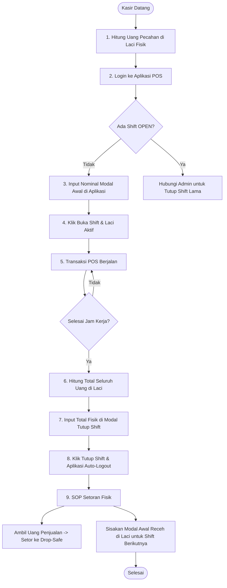

# SOP dan Sistem Kerja Manajemen Shift Kasir POS (Fordza Web)

Dokumen ini menjelaskan alur operasional fisik (SOP) dan desain logika sistem (*Shift Management / Cash Float*) pada POS Fordza Web. Dokumen ini juga berfungsi sebagai panduan teknis sekaligus bahan pertahanan sidang skripsi jika tim penguji mempertanyakan arsitektur laci kasir Anda.

---

## 🏛️ 1. Landasan Teori: Konsep Cash Float (Modal Laci)

Sistem POS Fordza Web menggunakan arsitektur **Cash Float (Petty Cash Laci)**. Setiap kasir yang bertugas memegang laci kasir fisik harus memiliki sesi digital (*Shift*) yang merekam aliran masuk dan keluar uang secara presisi.

### Pemisahan Tanggung Jawab Keuangan:
1. **Modal Awal (Starting Cash):** Uang pecahan kecil (receh) yang disediakan toko untuk uang kembalian pelanggan pertama.
2. **Omzet Penjualan (Revenue):** Akumulasi nominal belanja dari pelanggan yang membayar tunai.
3. **Expected Ending Cash (Sistem):** Total uang yang secara matematis *seharusnya* ada di laci kasir saat tutup shift:
   $$\text{Expected Ending Cash} = \text{Modal Awal} + \text{Total Penjualan Tunai}$$
4. **Actual Ending Cash (Laporan Kasir):** Jumlah lembaran uang fisik nyata yang dihitung manual oleh kasir di atas meja saat shift berakhir.

---

## 📋 2. Alur Kerja (SOP) Shift Kasir

Siklus harian shift kasir berjalan melalui 4 fase berikut:



### Fase A: Pembukaan Shift (Kasir Baru Datang)
1. Kasir **wajib** menghitung fisik uang pecahan di laci sebelum menyalakan komputer. (Misal: Ada pecahan receh total Rp 500.000).
2. Kasir login ke Fordza Web POS. Layar akan terblokir oleh *Shift Blocker Modal*.
3. Kasir mengetik nominal **Rp 500.000** pada kolom **Modal Awal** dan mengklik **"Buka Shift"**. 
4. Aplikasi terbuka, kasir bisa mulai melayani transaksi.

### Fase B: Operasional Harian
* Setiap transaksi pembayaran tunai (Cash) otomatis dikaitkan dengan `shiftId` yang sedang aktif di database.
* Uang dari pelanggan dimasukkan ke dalam laci, uang kembalian diambil dari laci.

### Fase C: Penutupan Shift (Kasir Pulang)
1. Kasir mengklik tombol **"Tutup Shift"** di sidebar.
2. Kasir **menghitung semua uang fisik** yang ada di laci (baik uang modal tadi maupun uang hasil penjualan). Misal terkumpul total **Rp 2.500.000**.
3. Kasir mengetik nominal **Rp 2.500.000** di kolom **"Total Uang Fisik di Laci Saat Ini"**, lalu mengklik **"Tutup Shift"**.
4. Sistem otomatis mencatat selisih (*variance*) dan melakukan **logout** akun kasir secara paksa demi keamanan.

### Fase D: SOP Handover (Pergantian Shift Tanpa Kehadiran Owner)
Setelah menekan tombol tutup shift di aplikasi:
1. Kasir A memilah uang Rp 2.500.000 tersebut menjadi dua bagian:
   * **Rp 2.000.000 (Pendapatan):** Dimasukkan ke amplop setoran dan dimasukkan ke brankas setor (*Drop-Safe Box*).
   * **Rp 500.000 (Modal Awal):** **Ditinggalkan tetap berada di laci meja kasir**.
2. Kasir B datang, menghitung sisa Rp 500.000 di laci, login ke sistem, menginput Rp 500.000 sebagai Modal Awal, lalu mulai bertransaksi.
3. Owner/Manajer tidak perlu stand-by di toko. Cukup mencocokkan total isi brankas *Drop-Safe* dengan log shift di dashboard admin secara berkala.

---

## 🏛️ 3. Pertanyaan Debat Sidang Skripsi (Dosen Penguji)

### ❓ Pertanyaan 1: "Apakah Modal Awal Kasir akan merusak Laporan Laba/Omzet Toko di dashboard Manajer?"
> [!NOTE]
> **Jawaban Telak:**
> *Tidak, Bapak/Ibu Dosen.* Sistem Fordza Web secara tegas membelah aliran uang ke dalam dua logika kalkulasi yang berbeda:
> 1. **Laporan Omzet Penjualan:** Ditarik murni dari akumulasi baris transaksi (`TransactionItem` -> `basePriceAtSale` × `quantity`). Data modal awal disimpan di tabel terpisah (`CashierShift`) dan tidak dilibatkan dalam grafik performa penjualan toko. Laporan omzet murni akan tampil jujur 100% senilai Rp 2.000.000.
> 2. **Laporan Audit Laci Kasir:** Kolom modal awal hanya digunakan di menu audit laci kasir untuk menghitung kesesuaian fisik laci (`Modal Awal + Penjualan = Fisik`).

### ❓ Pertanyaan 2: "Kenapa Kasir harus menginput Rp 2.500.000 saat tutup shift, padahal uang yang disetorkan ke brankas hanya Rp 2.000.000? Bukankah itu membingungkan?"
> [!IMPORTANT]
> **Jawaban Telak:**
> Penginputan Rp 2.500.000 bertujuan untuk **mengaudit kejujuran kasir sebelum uang tersebut dipisahkan**. 
> * Jika kasir menginput Rp 2.500.000, sistem menghitung:
>   $$\text{Selisih} = \text{Actual (2.500.000)} - \text{Expected (2.500.000)} = \mathbf{0\ (PAS)}$$
>   Ini membuktikan laci kasir aman. Setelah terbukti pas, barulah kasir melakukan pemisahan fisik (menyimpan Rp 2.000.000 ke brankas dan menyisakan Rp 500.000 di laci).
> * Jika kasir hanya menginput Rp 2.000.000 (karena berpatokan pada nominal setoran murni), sistem akan membaca bahwa uang fisik di laci kurang Rp 500.000, sehingga menerbitkan peringatan **DEFISIT/MINUS Rp 500.000**. Kasir akan dianggap menghilangkan uang modal awal oleh sistem.

---

## 💾 4. Arsitektur Database (Prisma Schema)

Logika shift kasir ini didukung oleh relasi tiga entitas utama berikut:

```prisma
// 1. Kasir / User
model Admin {
  id       String         @id @default(cuid())
  username String         @unique
  role     Role           @default(KASIR)
  shifts   CashierShift[]
}

// 2. Siklus Kerja / Laci Kasir
model CashierShift {
  id                 String       @id @default(cuid())
  adminId            String       @map("admin_id")
  admin              Admin        @relation(fields: [adminId], references: [id])
  startTime          DateTime     @default(now()) @map("start_time")
  endTime            DateTime?    @map("end_time")
  startingCash       Decimal      @map("starting_cash") @db.Decimal(12, 2)
  expectedEndingCash Decimal?     @map("expected_ending_cash") @db.Decimal(12, 2)
  actualEndingCash   Decimal?     @map("actual_ending_cash") @db.Decimal(12, 2)
  status             ShiftStatus  @default(OPEN)
  transactions       Transaction[]
}

// 3. Transaksi Penjualan
model Transaction {
  id            String         @id @default(cuid())
  invoiceNo     String         @unique @map("invoice_no")
  totalPrice    Decimal        @map("total_price") @db.Decimal(12, 2)
  status        TransactionStatus @default(PAID)
  paymentMethod String         @default("CASH") @map("payment_method")
  shiftId       String?        @map("shift_id")
  shift         CashierShift?  @relation(fields: [shiftId], references: [id])
}
```
